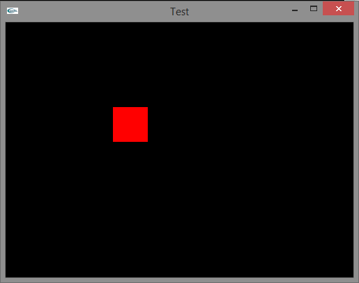

A basic program that I make for most new enviorments. This is just a box on the screen that the user can move around, the input is done via a timer and the keyboard events use booleans. This is to have smooth motion and multiple keystrokes.

