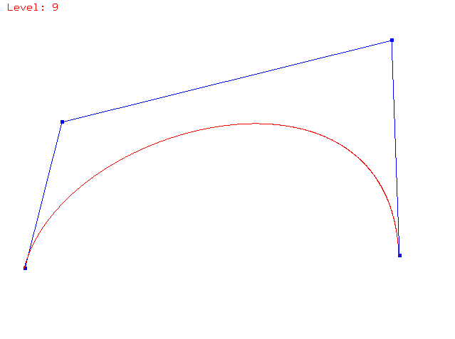

<h2>Bezier Curve Generator:<h2>

</img>

A program using OpenGL and GLUT to generate a n-level bezier curve based on a user inputed set of points.

<h4><strong>Requirements:</strong></h4>
   <ol>
      <li>User uses mouse clicks to define initial control polygon [ COMPLETE ]
         <ul><li>Use a motion callback function to generate "rubberbanding" effect for polyline definition [ COMPLETE ]</li></ul>
      </li>
      <li>Keyboard events defined as followed
      <ul>
         <li>"q" or "Q": exits the program [COMPLETE]</li>
         <li>"1", "2", ... "9" to draw a i-level generated polygon. [ COMPELTE ]</li>
         <li>"p" or "P": Toggle drawing of Origonal inital polygon. [ COMPLETE ]
            <ul>
            <li>By default inital 0-level is always draw with curve. [ COMPLETE ]</li>
            <li>In [0-level draw] the user can define new points on init poly. [ COMPLETE ]</li>
            <li>In [no level-0 draw] the user can't define new points on init poly. [ COMPLETE ]</li>
            </ul>
         </li>
      </ul>
      </li>
      <li>Generate Menu for all keyboard events. [ COMPLETE ]</li>
   </ol>
   
<h3><strong>Extra Features:</strong></h3>   
  <ol>
  	<li><em>Performaced enanced motion callback</em>: Then the curve generated by a motion call-back is generated the level is set to level-3 (is n > 3), then is restored to the old level. This makes generating the "preview" curve faster.</li>
		<li>"n" or "N": Clears points and curve on screen, for defining a new curve.</li>  
		<li>"d" or "D": Deletes last point entered point on curve.</li>
  </ol>
	

<h4><strong>Implementaion:</strong></h4>

<h6><em>Prototype 1 :</em></h6> 

<strong>Definition</strong>: User can create initial polygon, and the program will show all lines from the generation of a bezier curve from level-0 to level-1. 

   
   
   
Basic core functionality will be implemented:

   <ol>
   <li>User can create inital polygone with mouse clicks</li>
	<li>User can close the program with: exit button, "q", and "Q".</li>
	<li>All lines generated by bezierCurve() are shown.</li>
	<li>The points for the level-1 poly are idenified. </li>
	<li>Program shows inital poly and level-1 poly.</li>
	<li>User can create new polygon with "n" or "N" (This clears the currently level-0 poly).</li>
   </ol>
<h6><em>Prototype 2 :</em></h6> 

<strong>Definition</strong>: The level-n polygon is now drawn. The user can use "+" to do level-(i+1) and "-" to do level-(i-1). The user can also toggle level-0 and level-1 polygon. With the functionality of now adding points to the orignal vector being disabled on (display only: level-n poly), and adding points only on (display: level-0 and level-n poly)

  
Following functionality will be implemented:

  <ol>
  <li>Level-n level polygon implemented</li>
  <li>User can change bezierLevel with "+" and "-"</li>
  <li>User can toggle between control polygon with "p" or "P"</li>
  <li>Menu items implemented (called by right-click) </li>
  <li>User can remove last added point with "d" or "D"</li>
  <li>Problems with generation of bezier curve beond level-2 are now fixed (refersed order for match for poly-2)</li>
  <li>Problems with generation of bezier curve beond level-5 are now fixed (switched from int to float for points)</li>
  </ol>
