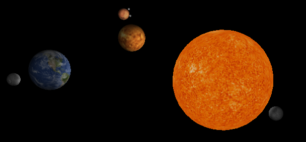

<em> Notice: It is reccommended to view this README file in a web broswer. </em>

<h2>Solar System:</h2>
</img>

<em>A program using OpenGL and GLUT to generate a 3D solar system.</em>

<h2><strong>Instructions:</strong></h2>
  <ol>
  <li><em><strong>Mouse Click and Hold:</strong></em> Allows to move the camera around the current point it is looking at (Yaw, Pitch)</li>
  <li><em><strong>z + Mouse Click and Hold:</strong></em> Holding the 'z' key while moving the mouse allows you to span the screens X and Y Axis</li>
  <li><em><strong>Arrow Keys Left and Right:</strong></em> Rotates the camera left and right.</li> 
  <li><em><strong>+</strong> Key:</em> Zoom in.</li> 
  <li><em><strong>-</strong> Key:</em> Zoom out</li> 
  <li><em><strong>1</strong> Key:</em> Toggle Sun Light.</li>   
  <li><em><strong>2</strong> Key:</em> Toggle Camera Light.</li>
  <li><em><strong>SPACE</strong> Key:</em> Toggle Animation.</li>  
  <li><em><strong>Q</strong> Key:</em> Exit program.</li>    
  </ol> 

<h2><strong>Project Notes and Bugs:</strong></h2>
   
   
For the project all of the requirements have been satisfied.

   
   
A few bugs that came up during development where problems with texture mapping Spheres, this problem was resolved by adding the deapth buffer. Along with this there were problems with the deapth buffer removing display from the screen, which was resloved with changing the <em>near</em> and <em>far</em> settings with the perspective. 

   
Apart from these being resolved there were not other visible bugs in the program, again this was not tested throughly, so there isn't a gurantee that it's bug free. A note is that I'm using a <em>timer</em> other than <em>idile</em> for animation, making it run the same on different systems.

   
<h4>

